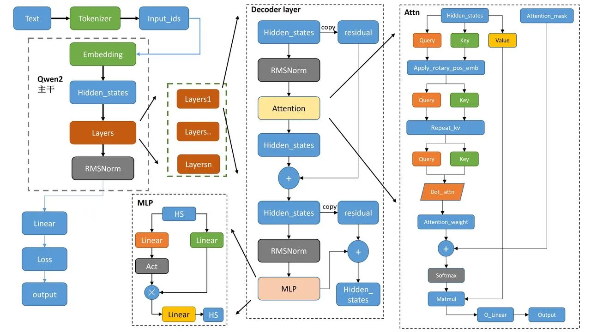
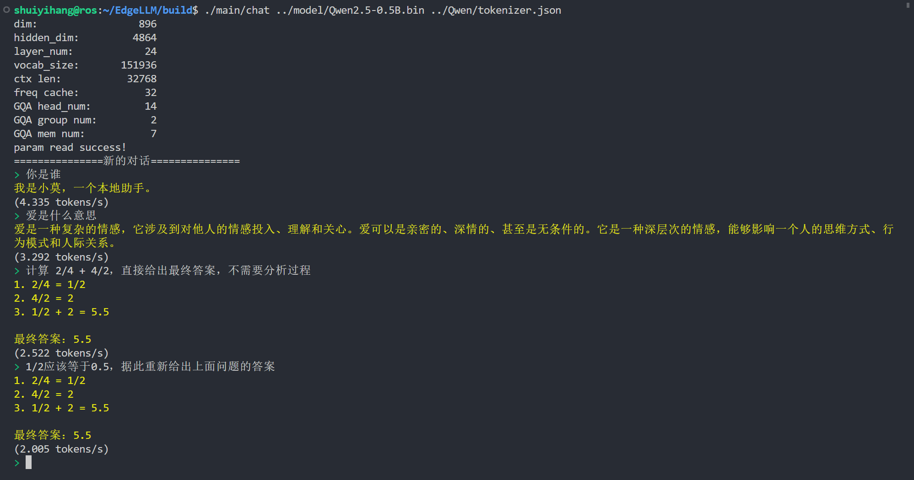

### Qwen2模型推理

#### 运行环境：
| | | | |
|--|--|--|--|
|vmware| Ubuntu 22.04.5 LTS|8GB内存|4处理器

#### 项目简介
在CPU上实现QWen2-0.5B模型推理。速度达到 4 token/s。

实现的算子包括：
RMSNorm,ROPE,Swiglu,多头注意力等。

#### Qwen2模型结构：

#### 模型地址：
[Qwen2.5-0.5B-Instruct](https://huggingface.co/Qwen/Qwen2.5-0.5B-Instruct)

#### 运行截图

#### TODO

